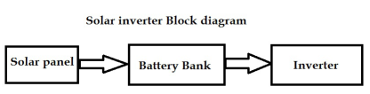

# CHAPTER 1 : INTRODUCTION

## 1.1 INTRODUCTION TO SOLAR ENERGY
In today's climate of growing energy needs and increasing environmental concern, alternatives to the use of non-renewable and polluting fossil fuels have to be investigated. One such alternative is solar energy.
Solar energy is quite simply the energy produced directly by the sun and collected elsewhere, normally the Earth. . The process creates heat and electromagnetic radiation. The heat remains in the sun and is instrumental in maintaining the thermonuclear reaction. The electromagnetic radiation (including visible light, infra-red light, and ultra-violet radiation) streams out into space in all directions.
Only a very small fraction of the total radiation produced reaches the Earth. The radiation that does reach the Earth is the indirect source of nearly every type of energy used today. Due to the nature of solar energy, two components are required to have a functional solar energy generator. These two components are a collector and a storage unit. The collector simply collects the radiation that falls on it and converts a fraction of it to other forms of energy (either electricity and heat or heat alone). The storage unit is required because of the non-constant nature of solar energy; at certain times only a very small amount of radiation will be received. At night or during heavy cloud cover, for example, the amount of energy produced by the collector will be quite small. The storage unit can hold the excess energy produced during the periods of maximum productivity, and release it when the productivity drops. In practice, a backup power supply is usually added, too, for the situations when the amount of energy required is greater than both what is being produced and what is stored in the container.

## 1.2. NEED OF SOLAR ENERGY
We use energy for many things, generally only few tasks consume most of the energy. These tasks include transportation, heating, cooling, and the generation of electricity. Solar energy can be applied to all four of these tasks with different levels of success.

## 1.3 BASIC PRINCIPLE OF SOLAR INVERTER
A solar inverter converts the variable direct current (DC) output of a photovoltaic (PV) solar panel into a utility frequency alternating current (AC) that can be fed into a commercial electrical grid or used by a local, off-grid electrical network. It is a critical component in a photovoltaic system, allowing the use of ordinary commercial appliances. Solar inverters have special functions adapted for use with photovoltaic arrays, including maximum power point tracking and anti-islanding protection.

## 1.4 DEMAND OF SOLAR INVERTER
There are two types of sources for electrical power generation. One is conventional and other is non- conventional. Today to generate most of electrical power conventional sources like coal, gas, nuclear power generators are used. Some of source are polluted the environment to generate the electricity. And nuclear energy is not much preferable because of its harmful radiation effect on the mankind. So some of the electrical power should be generated by non-conventional energy sources like solar, wind .

## 1.5 TYPES OF SOLAR INVERTER
Solar Inverter may be classified into three broad types.
1.Stand Alone Inverter- Used in isolated systems where the inverter draws its DC energy from batteries charged by photovoltaic arrays. Normally these do not interface in any way with the utility grid, and as such, are not required to have anti-islanding protection.
2.Grid Tie Inverter- They match phase with a utility-supplied sine wave. Grid-tie inverters are designed to shut down automatically upon loss of utility supply, for safety reasons. They do not provide backup power during utility outages.

3.Battery Backup Inverter- They are special inverters which are designed to draw energy from a battery, manage the battery charge via an onboard charger, and export excess energy to the utility grid. These inverters are capable of supplying AC energy to selected loads during a utility outage, and are required to have anti-islanding protection.
